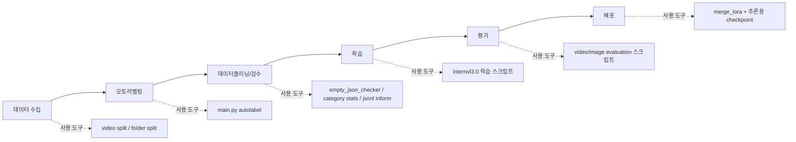

# train_eval_toolkit

 VLM(InternVL 계열) 데이터 구축, 오토라벨링, 학습, 평가, 체크포인트 배포 준비를 한 저장소에서 다루는 프로젝트입니다.



이 저장소는 `데이터 수집 -> 오토라벨링 -> 데이터클리닝(검수) -> 학습 -> 평가 -> 배포` 각 단계를 위한 도구 모음입니다.

## 단계별 도구 매핑

| 단계 | 핵심 작업 | 주요 도구/명령 | 근거 파일 |
|---|---|---|---|
| 데이터 수집 | 원본 데이터 정리/분할 | `main.py gj_split`, `main.py aihub_store_split`, `src/train_test_split_folder.py` | `main.py`, `src/preprocess/video_splitter.py`, `src/train_test_split_folder.py` |
| 오토라벨링 | 영상/이미지 자동 라벨 생성 | `main.py autolabel` | [`docs/labeling/autolabeling.md`](docs/labeling/autolabeling.md) |
| 데이터클리닝/검수 | 빈 라벨/분포/JSONL 품질 점검 | `empty_json_checker.py`, `json_category_stats.py`, `main.py jsonl_inform_check` | `src/data_checker/stats/empty_json_checker.py`, `src/stats/json_category_stats.py`, `src/utils/jsonl_inform_check.py` |
| 학습 | InternVL 파인튜닝 | `scripts/shell/internvl3.0/*.sh` | [`docs/train/training.md`](docs/train/training.md) |
| 평가 | 비디오/이미지 정량 평가 | `evaluate_video_classfication_edit.py`, `evaluate_image_classfication.py` | [`docs/eval/eval_image_falldown.md`](docs/eval/eval_image_falldown.md) |
| 평가 | 비디오 정성 평가 (threshold + 오버레이) | `evaluate_qualitative_video_threshold_image.py` | [`docs/eval/eval_quality.md`](docs/eval/eval_quality.md) |
| 배포 | LoRA 병합 후 추론용 체크포인트 생성 | `merge_lora.py` | `src/training/tools/merge_lora.py`, `scripts/pipe_line/train_eval_save_hyundai_8_20.sh` |

## 빠른 시작

### 1) 필수 다운로드 (ckpts + data)

```bash
# Hugging Face CLI 설치 후 로그인 (최초 1회)
curl -LsSf https://hf.co/cli/install.sh | bash
hf auth login

# Step 1: OpenGVLab/InternVL3-2B 폴더를 ckpts에 저장
mkdir -p ckpts/InternVL3-2B
hf download OpenGVLab/InternVL3-2B \
  --repo-type=model \
  --local-dir ckpts/InternVL3-2B
```

- Step 2 데이터 다운로드는 아래 가이드를 따르세요.
- Gangnam: [docs/data/download/guideline_gangnam.md](docs/data/download/guideline_gangnam.md)
- Hyundai Backhwajum: [docs/data/download/guideline_hyundai_backhwajum.md](docs/data/download/guideline_hyundai_backhwajum.md)

### 2) 환경 설치

**conda 환경 생성 (권장)**

```bash
# 1. Python 3.10 conda 환경 생성
conda create -n vlm python=3.10 -y
conda activate vlm

# 2. PyTorch (CUDA 12.1) 별도 설치
pip install torch==2.1.2 torchvision==0.16.2 \
    --index-url https://download.pytorch.org/whl/cu121

# 3. 나머지 의존성 설치
pip install -r requirements.txt

# 4. flash-attn (CUDA 빌드 필요, 시간 소요)
pip install flash-attn==2.3.6 --no-build-isolation
```

> PyTorch는 `--index-url`로 단독 지정하여 설치합니다. 다른 인덱스와의 충돌을 방지하고 올바른 CUDA wheel이 설치됩니다.

**import 종속성 검증**

```bash
PYTHONPATH="$(pwd)" pytest tests/test_imports.py -v
```

### 3) 오토라벨링 사전 설정

- Gemini 사용 시 `configs/config_gemini.py`의 모델/프로젝트 설정을 환경에 맞게 조정합니다.
- 서비스 계정 키 경로, API 키 등 민감 정보는 코드/문서에 하드코딩하지 말고 로컬 환경 변수 또는 비공개 설정으로 관리하세요.

## 단계별 실행 가이드 (핵심 런북)

### 1) 데이터 수집/정리

원본 폴더를 학습 가능한 구조로 분할/정리합니다.

```bash
# Gangjin 포맷 비디오 분할
python main.py gj_split -i data/raw/gj -o data/processed/gj -p 16

# AIHub Store 포맷 비디오 분할
python main.py aihub_store_split -i data/raw/aihub_store -o data/processed/aihub_store -p 16

# media+json 쌍 기준 train/test 폴더 분리
python src/train_test_split_folder.py -i data/processed/hyundai_backhwajum/hyundai_PoC_5camera_gen_ai -r 0.1
```

### 2) 오토라벨링

> 상세 내용: [docs/labeling/autolabeling.md](docs/labeling/autolabeling.md)

영상/이미지를 재귀 탐색해 동일 폴더에 `*.json` 라벨을 생성합니다.

```bash
# 비디오 라벨링
python main.py autolabel -i data/processed/gangnam/gaepo1_v2/Train/video/violence/violence/clip -opt gangnam -n 16 -m video

# 이미지 라벨링
python main.py autolabel -i data/processed/hyundai_backhwajum/abb_hyundai/train/falldown -opt hyundai_falldown -n 128 -m image
```

- 지원 options 목록, 환경 설정, 번역 기능 등은 [autolabeling.md](docs/labeling/autolabeling.md)를 참조하세요.
- 실패 항목은 `assets/logs/failed_videos_*.txt`에 기록됩니다.

### 3) 데이터클리닝(검수) + JSONL 생성

```bash
# 빈 JSON(clips) 점검
python src/data_checker/stats/empty_json_checker.py --json_dir data/raw/ai_hub_indoor_store_violence

# 카테고리 분포 점검
python src/stats/json_category_stats.py data/processed/hyundai_backhwajum

# 라벨 폴더 -> 학습용 JSONL 변환
python main.py label2jsonl \
  -i data/processed/gangnam/samsung/Train/clean/video/violence \
  -o data/instruction/train/train_gangnam_samsung_video_violence.jsonl \
  -dt video -opt train -ity clip -itk caption -tn violence

# JSONL 분포/유효성 점검
python main.py jsonl_inform_check -i data/instruction/train/train_gangnam_samsung_video_violence.jsonl

# 필요 시 train/test JSONL 분리
python main.py train_test_split -i data/instruction/train/train_total.jsonl -r 0.1 -o data/instruction
```

### 4) 학습

대표 학습 스크립트:

```bash
# 단독 학습 + LoRA 병합
GPUS=4 PER_DEVICE_BATCH_SIZE=2 bash scripts/shell/internvl3.0/train_sample_scripts.sh

# 학습 + 평가 전체 파이프라인
EPOCHS=20 GPUS=4 PER_DEVICE_BATCH_SIZE=2 bash scripts/pipe_line/train_eval_save_sample_scripts.sh
```

- 메타데이터 입력은 스크립트 내 `--meta_path`(`scripts/shell/data/*.json`)로 제어합니다.
- 상세 파라미터 설명 및 GPU 메모리 절약 팁: [docs/train/training.md](docs/train/training.md)

### 5) 평가

#### 5-1) 이미지 분류 정량 평가

JSONL 어노테이션 기반으로 Precision / Recall / F1 을 산출합니다.

```bash
PYTHONPATH="$(pwd)" python src/evaluation/evaluate_image_classfication.py \
  --checkpoint ckpts/InternVL3-2B_hyundai_8_20 \
  --annotation data/instruction/evaluation/test_hyundai_abb_image_falldown.jsonl \
  --image-root data \
  --out-dir results/eval_result_image \
  --batch-size 20 \
  --multi-gpu
```

> 참조 스크립트: `scripts/eval/eval_image_falldown/eval.sh`
> 상세 가이드: [docs/eval/eval_image_falldown.md](docs/eval/eval_image_falldown.md)

#### 5-2) 비디오 정성 평가 (Threshold + 이미지 오버레이)

슬라이딩 윈도우로 비디오를 추론하고 판정 결과를 프레임에 오버레이한 영상을 저장합니다.

```bash
PYTHONPATH="$(pwd)" python src/evaluation/evaluate_qualitative_video_threshold_image.py \
    --checkpoint ckpts/InternVL3-2B_hyundai_5_20 \
    --input-root "data/processed/hyundai_backhwajum/hyundai_video_macs_test/01_27" \
    --output-root "results/eval_quality/eva_quality_hyundai/InternVL3-2B_hyundai_5_20/falldown_poc_01_27" \
    --window-size 15 \
    --batch-size 40 \
    --threshold 1 \
    --multi-gpu
```

> 참조 스크립트: `scripts/eval/eval_quality/eval.sh`
> 상세 가이드: [docs/eval/eval_quality.md](docs/eval/eval_quality.md)

#### 5-3) 비디오 정량 평가 (torchrun)

```bash
PYTHONPATH="$(pwd)" torchrun --nproc_per_node=2 src/evaluation/evaluate_video_classfication_edit.py \
  --checkpoint ckpts/InternVL3-2B_gangnam \
  --annotation data/instruction/evaluation/test_gangnam.jsonl \
  --video-root data \
  --out-dir results/eval_result \
  --num-frames 12 \
  --workers-per-gpu 8 \
  --prompt-type violence
```

### 6) 배포 (체크포인트 배포)

이 저장소에서 배포는 서버 서빙이 아니라, **LoRA 병합 후 추론 가능한 체크포인트를 생성해 배포 가능한 상태로 만드는 것**을 의미합니다.

```bash
MERGE_DIR="InternVL3-2B_gangnam_release"
mkdir -p ckpts/$MERGE_DIR

PYTHONPATH="$(pwd)" python src/training/tools/merge_lora.py ckpts/lora ckpts/$MERGE_DIR
cp ckpts/InternVL3-2B/*.py ckpts/$MERGE_DIR/
cp ckpts/InternVL3-2B/config.json ckpts/$MERGE_DIR/
```

- 학습+평가+저장 파이프라인 예시는 `scripts/pipe_line/train_eval_save_sample_scripts.sh`를 참고하세요.

## 실제 프로젝트 구조 (핵심)

```text
.
├── configs/                    # 오토라벨/전처리/학습 설정
├── scripts/
│   ├── shell/internvl3.0/      # 학습 실행 스크립트
│   ├── eval/                   # 평가 실행 스크립트
│   ├── utils/                  # 데이터 유틸 실행 스크립트
│   └── pipe_line/              # 학습-평가 묶음 파이프라인
├── src/
│   ├── preprocess/             # 데이터 분할/변환
│   ├── _autolabeling/          # Gemini 기반 오토라벨링 (docs/labeling/autolabeling.md)
│   ├── data_checker/           # 데이터 점검
│   ├── evaluation/             # 정량/정성 평가
│   └── training/               # InternVL 학습/모델/도구
├── main.py                     # 통합 CLI 엔트리포인트
├── requirements.txt
└── README.md
```

## 주요 산출물 경로

- 원천/가공 데이터: `data/raw`, `data/processed`
- 학습/평가용 어노테이션: `data/instruction/train`, `data/instruction/evaluation`
- 체크포인트: `ckpts/lora`, `ckpts/<MERGE_DIR>`
- 평가 결과: `results/eval_result*`, `results/eval_quality*`
- 오토라벨 실패 로그: `assets/logs/failed_videos_*.txt`

## 운영/보안 주의사항

- 서비스 계정 키 경로, API 키, 내부 절대 경로를 저장소에 커밋하지 마세요.
- `configs/config_gemini.py` 등 설정 파일은 환경별로 분리해 관리하세요.
- 대용량 데이터/체크포인트는 Git 대신 별도 스토리지(예: NAS, 오브젝트 스토리지) 사용을 권장합니다.
- 학습 전 `jsonl_inform_check`, `json_category_stats`로 데이터 품질을 먼저 확인하세요.

## 테스트

- 테스트 코드는 루트 `tests/`에서 관리합니다.
- 기본 실행: `pytest -q`
- 통합/라이브 테스트는 `integration` marker로 분리 관리합니다.
- 상세 명세: [docs/testing/pytest.md](docs/testing/pytest.md)
