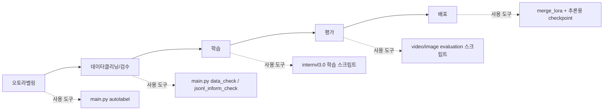

# train_eval_toolkit

 VLM(InternVL 계열) 데이터 구축, 오토라벨링, 학습, 평가, 체크포인트 배포 준비를 한 저장소에서 다루는 프로젝트입니다.



이 저장소는 `오토라벨링 -> 데이터클리닝(검수) -> 학습 -> 평가 -> 배포` 각 단계를 위한 도구 모음입니다. 데이터 수집은 별도로 진행합니다.

## 단계별 도구 매핑

| 단계 | 핵심 작업 | 주요 도구/명령 | 근거 파일 |
|---|---|---|---|
| 오토라벨링 | 영상/이미지 자동 라벨 생성 | `main.py autolabel` | [`docs/labeling/autolabeling.md`](docs/labeling/autolabeling.md) |
| 데이터클리닝/검수 | 빈 라벨/분포/JSONL 품질 점검 | `main.py data_check`, `main.py jsonl_inform_check` | `src/data_checker/stats/json_checker.py`, `src/utils/jsonl_inform_check.py` |
| 데이터클리닝/검수 | JSON 라벨 → 학습/평가용 JSONL 변환 | `main.py label2jsonl` | [`docs/cleaning/label_to_jsonl.md`](docs/cleaning/label_to_jsonl.md) |
| 학습 | InternVL 파인튜닝 | `scripts/shell/internvl3.0/*.sh` | [`docs/train/training.md`](docs/train/training.md) |
| 평가 | 비디오/이미지 정량 평가 | `evaluate_video_classfication_edit.py`, `evaluate_image_classfication.py` | [`docs/eval/eval_image_falldown.md`](docs/eval/eval_image_falldown.md) |
| 평가 | 비디오 정성 평가 (threshold + 오버레이) | `evaluate_qualitative_video_threshold_image.py` | [`docs/eval/eval_quality.md`](docs/eval/eval_quality.md) |
| 평가 | vLLM 자동화 파이프라인 (Docker→평가→제출) | `python -m src.vllm_pipeline.cli` | [`docs/eval/vllm_pipeline.md`](docs/eval/vllm_pipeline.md) |
| 평가 | LMDeploy 벤치마크 파이프라인 (파인튜닝 모델) | `python -m src.lmdeploy_pipeline` | [`docs/eval/lmdeploy_pipeline.md`](docs/eval/lmdeploy_pipeline.md) |
| 배포 | LoRA 병합 후 추론용 체크포인트 생성 | `merge_lora.py` | `src/training/tools/merge_lora.py`, `scripts/pipe_line/train_eval_save_hyundai_8_20.sh` |

## 빠른 시작

### 1) 필수 다운로드 (ckpts + data)

```bash
# Hugging Face CLI 설치 후 로그인 (최초 1회)
curl -LsSf https://hf.co/cli/install.sh | bash
hf auth login

# Step 1: OpenGVLab/InternVL3-2B 폴더를 ckpts에 저장
mkdir -p ckpts/InternVL3-2B
hf download OpenGVLab/InternVL3-2B \
  --repo-type=model \
  --local-dir ckpts/InternVL3-2B
```

- Step 2 데이터 다운로드는 아래 가이드를 따르세요.
- Gangnam: [docs/data/download/guideline_gangnam.md](docs/data/download/guideline_gangnam.md)
- Hyundai Backhwajum: [docs/data/download/guideline_hyundai_backhwajum.md](docs/data/download/guideline_hyundai_backhwajum.md)

### 2) 환경 설치

**conda 환경 생성 (권장)**

```bash
# 1. Python 3.10 conda 환경 생성
conda create -n vlm python=3.10 -y
conda activate vlm

# 2. PyTorch (CUDA 12.1) 별도 설치
pip install torch==2.1.2 torchvision==0.16.2 \
    --index-url https://download.pytorch.org/whl/cu121

# 3. 나머지 의존성 설치
pip install -r requirements.txt

# 4. flash-attn (CUDA 빌드 필요, 시간 소요)
pip install flash-attn==2.3.6 --no-build-isolation
```

> PyTorch는 `--index-url`로 단독 지정하여 설치합니다. 다른 인덱스와의 충돌을 방지하고 올바른 CUDA wheel이 설치됩니다.

**import 종속성 검증**

```bash
PYTHONPATH="$(pwd)" pytest tests/test_imports.py -v
```

### 3) 퀵스타트

데이터 다운로드 및 환경 설치까지 완료됐다면 샘플 데이터(`gangnam_yeoksam2_v2_image_falldown`)로 학습부터 평가까지 바로 실행할 수 있습니다.

> 상세 가이드: [docs/train/quick_start.md](docs/train/quick_start.md)


## 단계별 실행 가이드

### 1) 오토라벨링

> 상세 내용: [docs/labeling/autolabeling.md](docs/labeling/autolabeling.md)

영상/이미지를 재귀 탐색해 동일 폴더에 `*.json` 라벨을 생성합니다.

```bash
# 비디오 라벨링
python main.py autolabel -i data/processed/gangnam/gaepo1_v2/Train/video/violence/violence/clip -opt vio -n 16 -m video

# 이미지 라벨링
python main.py autolabel -i data/processed/hyundai_backhwajum/abb_hyundai/train/falldown -opt hyundai_falldown -n 128 -m image

# 모델 지정 (기본: gemini-3-pro-preview)
python main.py autolabel -i data/processed/gangnam/gaepo1_v2/Train/video/violence/violence/clip -opt vio -n 16 -m video --model gemini-3-flash-preview

# 기존 라벨 강제 덮어쓰기 (기본: 유효한 라벨이 있으면 스킵)
python main.py autolabel -i data/processed/gangnam/gaepo1_v2/Train/video/violence/violence/clip -opt vio -n 16 -m video --overwrite
```

- 지원 options 목록, 환경 설정, 번역 기능 등은 [autolabeling 문서](docs/labeling/autolabeling.md)를 참조하세요.
- 에러 처리, 재시도, JSON 파싱 등 내부 동작 상세는 [autolabeling_internals 문서](docs/labeling/autolabeling_internals.md)를 참조하세요.
- 실패 항목은 `assets/logs/failed_files_*.txt`에 기록됩니다.

### 2) 데이터클리닝(검수) + JSONL 생성

```bash
# JSON 라벨 카테고리 분포 점검 (하위 폴더 재귀 탐색)
python main.py data_check -i data/processed/gangnam -t json
```

> 출력 예시 및 옵션 상세: [docs/cleaning/data_check.md](docs/cleaning/data_check.md)
> 라벨 → JSONL 변환 옵션 전체 설명: [docs/cleaning/label_to_jsonl.md](docs/cleaning/label_to_jsonl.md)

Gangnam 데이터를 다운받아 압축 해제하면 `data/processed/gangnam/` 아래 `yeoksam2_v2/`, `gaepo1_v2/` 등의 구역 폴더가 생성됩니다. 각 구역 폴더 하위는 `Train/video/<category>/`, `Test/video/<category>/`, `Train/image/<category>/`, `Test/image/<category>/` 구조입니다.

```bash
# [비디오] 학습용 JSONL 생성 (Train 폴더 기준)
python main.py label2jsonl \
  -i data/processed/gangnam/yeoksam2_v2/Train/video/violence \
  -o data/instruction/train/train_gangnam_yeoksam2_v2_video_violence.jsonl \
  -dt video -opt train -ity clip -itk caption -tn violence

# [비디오] 평가용 JSONL 생성 (Test 폴더 기준)
python main.py label2jsonl \
  -i data/processed/gangnam/yeoksam2_v2/Test/video/falldown \
  -o data/instruction/evaluation/test_gangnam_yeoksam2_v2_video_falldown.jsonl \
  -dt video -opt test -ity clip -itk caption -tn falldown

# [이미지] 학습용 JSONL 생성 (Train 폴더 기준)
python main.py label2jsonl \
  -i data/processed/gangnam/yeoksam2_v2/Train/image/falldown \
  -o data/instruction/train/train_gangnam_yeoksam2_v2_image_falldown.jsonl \
  -dt image -opt train -ity capture_frame -itk caption -tn falldown

# [이미지] 평가용 JSONL 생성 (Test 폴더 기준)
python main.py label2jsonl \
  -i data/processed/gangnam/yeoksam2_v2/Test/image/falldown \
  -o data/instruction/evaluation/test_gangnam_yeoksam2_v2_image_falldown.jsonl \
  -dt image -opt test -ity capture_frame -itk caption -tn falldown

# JSONL 분포/유효성 점검
python main.py jsonl_inform_check -i data/instruction/train/train_gangnam_yeoksam2_v2_image_falldown.jsonl

# 필요 시 train/test JSONL 분리
python main.py train_test_split \
  -i data/instruction/train/train_gangnam_yeoksam2_v2_image_falldown.jsonl \
  -r 0.1 -o data/instruction
```

### 3) 학습

> **학습 전 3단계 준비가 필요합니다.** 자세한 내용: [docs/train/pre_training_checklist.md](docs/train/pre_training_checklist.md)
>
> 1. 라벨 → JSONL 변환 (`main.py label2jsonl`)
> 2. 메타 JSON 파일 생성 (`scripts/shell/data/*.json`) — 어떤 JSONL을 학습에 쓸지 정의
> 3. 학습 스크립트에서 `META_PATH` 변수를 생성한 메타 JSON 경로로 수정

대표 학습 스크립트:

```bash
# 단독 학습 + LoRA 병합
GPUS=4 PER_DEVICE_BATCH_SIZE=2 bash scripts/shell/internvl3.0/train_sample_scripts.sh

# 학습 + 평가 전체 파이프라인
EPOCHS=20 GPUS=4 PER_DEVICE_BATCH_SIZE=2 bash scripts/pipe_line/train_eval_save_sample_scripts.sh
```

- 학습 전 체크리스트: [docs/train/pre_training_checklist.md](docs/train/pre_training_checklist.md)
- 상세 파라미터 설명 및 GPU 메모리 절약 팁: [docs/train/training.md](docs/train/training.md)

### 4) 평가

#### 4-1) 이미지 분류 정량 평가

JSONL 어노테이션 기반으로 Precision / Recall / F1 을 산출합니다.

```bash
PYTHONPATH="$(pwd)" python src/evaluation/evaluate_image_classfication.py \
  --checkpoint ckpts/InternVL3-2B_hyundai_8_20 \
  --annotation data/instruction/evaluation/test_hyundai_abb_image_falldown.jsonl \
  --image-root data \
  --out-dir results/eval_result_image \
  --batch-size 20 \
  --multi-gpu
```

> 참조 스크립트: `scripts/eval/eval_image_falldown/eval.sh`
> 상세 가이드: [docs/eval/eval_image_falldown.md](docs/eval/eval_image_falldown.md)

#### 4-2) 비디오 정성 평가 (Threshold + 이미지 오버레이)

슬라이딩 윈도우로 비디오를 추론하고 판정 결과를 프레임에 오버레이한 영상을 저장합니다.

```bash
PYTHONPATH="$(pwd)" python src/evaluation/evaluate_qualitative_video_threshold_image.py \
    --checkpoint ckpts/InternVL3-2B_hyundai_5_20 \
    --input-root "data/processed/hyundai_backhwajum/hyundai_video_macs_test/01_27" \
    --output-root "results/eval_quality/eva_quality_hyundai/InternVL3-2B_hyundai_5_20/falldown_poc_01_27" \
    --window-size 15 \
    --batch-size 40 \
    --threshold 1 \
    --multi-gpu
```

> 참조 스크립트: `scripts/eval/eval_quality/eval.sh`
> 상세 가이드: [docs/eval/eval_quality.md](docs/eval/eval_quality.md)

#### 4-3) 비디오 정량 평가 (torchrun)

```bash
PYTHONPATH="$(pwd)" torchrun --nproc_per_node=2 src/evaluation/evaluate_video_classfication_edit.py \
  --checkpoint ckpts/InternVL3-2B_gangnam \
  --annotation data/instruction/evaluation/test_gangnam.jsonl \
  --video-root data \
  --out-dir results/eval_result \
  --num-frames 12 \
  --workers-per-gpu 8 \
  --prompt-type violence
```

#### 4-4) vLLM 자동화 파이프라인 (Docker → 평가 → 제출)

YAML 설정 하나로 Docker 컨테이너 기동부터 벤치마크 평가, 결과 제출, 컨테이너 정리까지 자동 실행합니다.

```bash
conda activate llm
python -m src.vllm_pipeline.cli -c configs/vllm_pipeline/qwen35_2b_fire.yaml

# 특정 단계만 실행
python -m src.vllm_pipeline.cli -c configs/vllm_pipeline/qwen35_2b_fire.yaml --steps evaluate submit
```

YAML `evaluate.overwrite_results` 옵션으로 기존 결과 덮어쓰기/스킵 제어 가능:

```yaml
evaluate:
  overwrite_results: true   # true(기본값)=항상 덮어쓰기, false=기존 CSV 존재+row수 일치 시 스킵
```

> 상세 가이드: [docs/eval/vllm_pipeline.md](docs/eval/vllm_pipeline.md)

#### 4-5) LMDeploy 벤치마크 파이프라인 (파인튜닝 모델)

파인튜닝 완료된 InternVL3 계열 로컬 모델의 **최종 벤치마크 평가** 전용 파이프라인입니다. 테스트셋 평가(Precision/Recall/F1)와는 별개로, PoC 리더보드 벤치마크 테스트에 사용합니다. YAML 설정 하나로 모델 존재 확인(없으면 HuggingFace 자동 다운로드), Docker 컨테이너(LMDeploy) 기동, 벤치마크 평가, 결과 제출, 컨테이너 정리까지 자동 실행합니다.

```bash
conda activate llm
python -m src.lmdeploy_pipeline -c configs/lmdeploy_pipeline/internvl3_2b_fire.yaml

# 특정 단계만 실행
python -m src.lmdeploy_pipeline -c configs/lmdeploy_pipeline/internvl3_2b_fire.yaml --steps evaluate submit
```

YAML에서 `docker.hf_repo_id`를 설정하면 `model_path`에 모델이 없을 때 HuggingFace에서 자동 다운로드합니다:

```yaml
docker:
  model_path: "ckpts/PIA_AI2team_VQA_falldown"
  hf_repo_id: "PIA-SPACE-LAB/PIA_AI2team_VQA_falldown"  # 모델 없으면 자동 다운로드
```

> 사전 준비 및 상세 가이드: [docs/eval/lmdeploy_pipeline.md](docs/eval/lmdeploy_pipeline.md)
> YAML 설정 작성법: [docs/eval/lmdeploy_yaml_guide.md](docs/eval/lmdeploy_yaml_guide.md)

### 5) 배포 (체크포인트 배포)

이 저장소에서 배포는 서버 서빙이 아니라, **LoRA 병합 후 추론 가능한 체크포인트를 생성해 배포 가능한 상태로 만드는 것**을 의미합니다.

```bash
MERGE_DIR="InternVL3-2B_gangnam_release"
mkdir -p ckpts/$MERGE_DIR

PYTHONPATH="$(pwd)" python src/training/tools/merge_lora.py ckpts/lora ckpts/$MERGE_DIR
cp ckpts/InternVL3-2B/*.py ckpts/$MERGE_DIR/
cp ckpts/InternVL3-2B/config.json ckpts/$MERGE_DIR/
```

- 학습+평가+저장 파이프라인 예시는 `scripts/pipe_line/train_eval_save_sample_scripts.sh`를 참고하세요.

## 실제 프로젝트 구조 (핵심)

```text
.
├── configs/                    # 프롬프트/전처리/학습 설정
├── scripts/
│   ├── shell/internvl3.0/      # 학습 실행 스크립트
│   ├── eval/                   # 평가 실행 스크립트
│   ├── utils/                  # 데이터 유틸 실행 스크립트
│   └── pipe_line/              # 학습-평가 묶음 파이프라인
├── src/
│   ├── preprocess/             # 데이터 분할/변환
│   ├── _autolabeling/          # Gemini 기반 오토라벨링 (docs/labeling/autolabeling.md)
│   ├── data_checker/           # 데이터 점검
│   ├── evaluation/             # 정량/정성 평가
│   ├── vllm_pipeline/          # vLLM 자동화 파이프라인 (Docker→평가→제출)
│   ├── lmdeploy_pipeline/      # LMDeploy 벤치마크 파이프라인 (파인튜닝 모델)
│   └── training/               # InternVL 학습/모델/도구
├── main.py                     # 통합 CLI 엔트리포인트
├── requirements.txt
└── README.md
```

## 주요 산출물 경로

- 원천/가공 데이터: `data/raw`, `data/processed`
- 학습/평가용 어노테이션: `data/instruction/train`, `data/instruction/evaluation`
- 체크포인트: `ckpts/lora`, `ckpts/<MERGE_DIR>`
- 평가 결과: `results/eval_result*`, `results/eval_quality*`
- 오토라벨 실패 로그: `assets/logs/failed_files_*.txt`

## 운영/보안 주의사항

- 서비스 계정 키 경로, API 키, 내부 절대 경로를 저장소에 커밋하지 마세요.
- `configs/config_gemini.py` 등 설정 파일은 환경별로 분리해 관리하세요.
- 대용량 데이터/체크포인트는 Git 대신 별도 스토리지(예: NAS, 오브젝트 스토리지) 사용을 권장합니다.
- 학습 전 `main.py data_check`, `main.py jsonl_inform_check`로 데이터 품질을 먼저 확인하세요.

## 테스트

- 테스트 코드는 루트 `tests/`에서 관리합니다.
- 기본 실행: `pytest -q`
- 통합/라이브 테스트는 `integration` marker로 분리 관리합니다.
- 상세 명세: [docs/testing/pytest.md](docs/testing/pytest.md)
